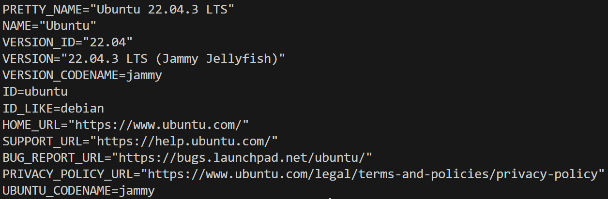

# Webscraping for Business
<br />
<p align="center">
  <a href="https://github.com/jgome284/Webscraping-for-Business">
    
  </a>

  <h3 align="center">Foreword</h3>

  <p align="center">
    Webscraping for business with Scrapy and Playwright, Ubuntu devcontainer for development on Visual Studio Code.
    <br />
    <a href="https://github.com/jgome284/Webscraping-for-Business/issues">Report Bug</a>
    ·
    <a href="https://github.com/jgome284/Webscraping-for-Business/issues">Request Feature</a>
  </p>
</p>


<!-- TABLE OF CONTENTS -->
## Table of Contents
<div style='text-align:'>
  <ol>
    <li>
      <a href="#about">About</a>
    </li>
    <li>
      <a href="#prerequisites">Prerequisites</a>
    </li>
    <li>
      <a href="#getting-started">Getting Started</a>
    </li>
    <li>
      <a href="#license">License</a>
    </li>
  </ol>
</details>
</div>


<!-- ABOUT THE PROJECT -->
## About
This project includes a Dev Container for Visual Studio Code. It serves as a full-featured development environment with everything needed to run the application. Dev Containers separate tools, libraries, or runtimes needed for working with a codebase. They aid in continuous integration and testing. Dev containers can be run locally or remotely, in a private or public cloud, in a variety of supporting tools and editors.

[This devcontainer](.devcontainer), is built IAW the [dev containers specification](https://containers.dev/implementors/spec/) and tailored for a build environment that runs Ubuntu version 22.04 and Python. Software libraries are installed in accordance with [requirements.txt](./.devcontainer/requirements.txt). Additionally, the devcontainer has git for version control and several extensions installed for Visual Studio Code as development utilities.

<!-- PREREQUISITES -->
## Prerequisites
To start, you need to have Docker Engine and Docker Compose on your machine. You can either:
* Install Docker Desktop which includes both Docker Engine and Docker Compose
* Install Docker Engine and Docker Compose as standalone binaries

This devcontainer is setup for development on Visual Studio Code. You should have it installed along with the [remote development pack](https://marketplace.visualstudio.com/items?itemName=ms-vscode-remote.vscode-remote-extensionpack) to enable the IDE's devcontainers functionality.

Create a `credentials.txt` file to host your git configuration settings. This file is utilized by the devcontainer's `postCreateCommand` as specified in `.devcontainer.json`. The format of this file should looks as such:

```sh
User:"YOUR NAME"
Email:"YOUR EMAIL"
```

All dependencies within your [requirements.txt](./.devcontainer/requirements.txt) file will be handled during the build process with Docker.


<!-- GETTING STARTED -->
## Getting started
Open Docker Desktop to run the Docker daemon, a background process that manages and coordinates Docker containers on your system. On VS Code, start the development container by running `Dev Containers: Rebuild and Reopen In Container` in the command palette. It can be accessed with the keyboard shortcut `ctrl + shift + P` on your keyboard. The command shows up as follows:


Doing so will start the build process for the devcontainer. Visual Studio will establish a remote connection to the development container with several common python extensions installed in the IDE. Of note, when a successful connection is established to the container, info for the Ubuntu OS is displayed as shown below:



Once the container launches successfully, install browser(s) for [playwright](https://playwright.dev/python/). You will only need to run the following commands once:

``` sh
playwright install
```

You can also install a subset of the available browsers instead:

``` sh
playwright install firefox chromium
```
Complete playwright configuration by installing all system dependencies:

``` sh
playwright install-deps 
```

Or, install a subset of system dependencies to support the browser you installed:

```sh
playwright install-deps chromium
```

[Playwright](https://playwright.dev/python/) will be used to prerender websites. Doing so gives [Scrapy](https://docs.scrapy.org/en/latest/intro/overview.html) access it would otherwise lack to dynamically load content via JavaScript; Scrapy doesn’t support JavaScript execution by default.

Run the spider to verify that it works:

```sh
scrapy crawl doral
```

## License
Distributed under the MIT License. See `LICENSE` for more information.